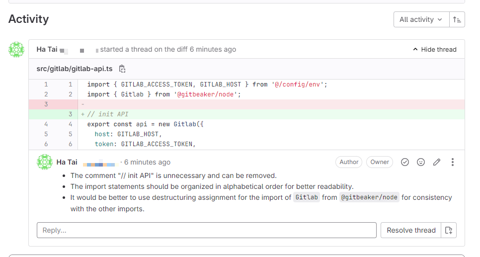

# @hataiit9x/review-code-ai

## Summary



`@hataiit9x/review-code-ai` It is a small tool used for code review in GitLab Merge Requests. It supports calling the GitLab API for private deployment and uses the OpenAI API to obtain review results. Please note that when using it, ensure compliance with company regulations. 😉


## Features

- 🛠️ Support configuration GitLab API address
- 🌍 Support configuration OpenAI proxy API address to solve the problem that the OpenAI API may not be accessible
- 🆔 Support configuration OpenAI organization ID
- ⚙️ Support configuration OpenAI API Key to implement load balancing of interface calls (multiple Keys are separated by commas)
- 📦 Support configuration OpenAI custom model ID
- 📝 Support configuration OpenAI review mode (OpenAI or Gemini)
- 📦 Support configuration GitLab Project ID
- 📦 Support configuration GitLab Merge Request ID
- 🚀 Support running in CI/CD
- 🚦 Automatically wait and try again when the rate limit is exceeded
- 💬 The review results are appended to the location of the corresponding code block in the form of comments


## Install

```sh
npm i @hataiit9x/review-code-ai
`````

## Use

### Use via shell script

```shell
Usage: review-code-ai [options]

Options:
  -g, --gitlab-api-url <string>       GitLab API URL (default: " https://gitlab.com/api/v4")
  -t, --gitlab-access-token <string>  GitLab Access Token
  -o, --openai-api-url <string>       OpenAI API URL (default: "https://api.openai.com/v1")
  -a, --openai-access-token <string>  OpenAI Access Token
  -p, --project-id <number>           GitLab Project ID
  -m, --merge-request-id <string>     GitLab Merge Request ID
  -org, --organization-id <number>    organization ID
  -c, ----custom-model <string>       Custom Model ID (default: "gpt-3.5-turbo")
  -mode, --mode <string>              Mode use OpenAI or Gemini (default: openai)
  -h, --help                          display help for command
```

Example:

```sh
review-code-ai -g https://gitlab.com/api/v4 -t glpat-xxxxxxx -o https://api.openai.com -a skxxxxxxx,skxxxxxxx -p  -c gpt-3.5-turbo 432288 -m 8
```

### Use in CI

Set the `GITLAB_TOKEN` and `CHATGPT_KEY` variables in GitLab CI/CD, `.gitlab-ci.yml` is as follows:

```yml
stages:
  - merge-request

Code Review:
  stage: merge-request  
  image: node:16
  script:
    - npm i @hataiit9x/review-code-ai -g
    - review-code-ai -t "$GITLAB_TOKEN" -a "$CHATGPT_KEY" -c "$CUSTOM_MODELS" -p "$CI_MERGE_REQUEST_PROJECT_ID" -m "$CI_MERGE_REQUEST_IID"
  only:
    - merge_requests
  when: on_success
```

## contribute
Welcome to contribute code, ask questions and suggestions! 👏

## License
This project is based on the MIT license. See the LICENSE file for details. 📜