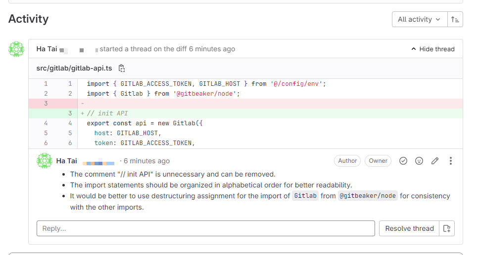

# @hataiit9x/review-code-ai



A CLI tool for automated code review on GitLab Merge Requests using AI (OpenAI or Google Gemini).

## Features

- 🤖 Support for OpenAI and Google Gemini as AI backends
- 🛠️ Configurable GitLab API URL (supports self-hosted instances)
- ⚙️ Load balancing across multiple API keys (comma-separated)
- � DSesigned for CI/CD pipeline integration
- 🚦 Automatic retry on rate limit (429 errors)
- 💬 Posts review comments directly on the MR at relevant code locations

## Installation

```bash
npm install -g @hataiit9x/review-code-ai
```

## Usage

### CLI Options

```
Usage: review-code-ai [options]

Options:
  -g, --gitlab-api-url <string>       GitLab API URL (default: "https://gitlab.com/api/v4")
  -t, --gitlab-access-token <string>  GitLab Access Token
  -o, --openai-api-url <string>       OpenAI/Gemini API URL (default: "https://api.openai.com/v1")
  -a, --openai-access-token <string>  API Access Token (supports multiple keys separated by comma)
  -p, --project-id <number>           GitLab Project ID
  -m, --merge-request-id <string>     GitLab Merge Request ID
  -org, --organization-id <string>    OpenAI Organization ID (optional)
  -c, --custom-model <string>         Custom Model ID (default: "gpt-3.5-turbo")
  -mode, --mode <string>              AI mode: "openai" or "gemini" (default: "openai")
  -h, --help                          Display help
```

### Example

```bash
# Using OpenAI
review-code-ai \
  -t glpat-xxxxxxx \
  -a sk-xxxxxxx \
  -p 432288 \
  -m 8

# Using Gemini
review-code-ai \
  -t glpat-xxxxxxx \
  -o https://generativelanguage.googleapis.com \
  -a YOUR_GEMINI_API_KEY \
  -c gemini-1.5-flash-latest \
  -mode gemini \
  -p 432288 \
  -m 8
```

### GitLab CI/CD Integration

Add the following to your `.gitlab-ci.yml`:

```yaml
stages:
  - review

code-review:
  stage: review
  image: node:18
  script:
    - npm install -g @hataiit9x/review-code-ai
    - review-code-ai -t "$GITLAB_TOKEN" -a "$CHATGPT_KEY" -c "$CUSTOM_MODEL" -p "$CI_MERGE_REQUEST_PROJECT_ID" -m "$CI_MERGE_REQUEST_IID"
  rules:
    - if: $CI_PIPELINE_SOURCE == "merge_request_event"
```

Required CI/CD variables:
- `GITLAB_TOKEN` - GitLab access token with API permissions
- `CHATGPT_KEY` - OpenAI or Gemini API key
- `CUSTOM_MODEL` - (Optional) Model ID to use

## Contributing

Welcome to contribute code, ask questions and suggestions! 👏

## License

MIT

---

This README was written by Kiro
